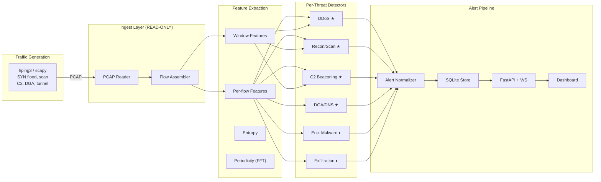

# SIH — AI-Based Detection of Cyber Threats in Unidirectional IP Traffic

> A streaming pipeline that ingests simulated one-directional IP traffic, extracts features per flow, classifies against 6 threat categories, and emits structured alerts to a live dashboard.

## Architecture



**★ Tier 1** (fully implemented) &nbsp; **◐ Tier 2** (partially implemented)

### One-Way Constraint (Data Diode)

The ingest layer is **architecturally read-only**:
- No outbound socket connections
- No DNS resolution
- No HTTP requests to external services
- No payload decryption (TLS analysed via JA3/metadata only)
- Verifiable by code review: `src/ingest/` imports only `scapy` for parsing

## Quick Start

```bash
# 1. Install dependencies
pip install -r requirements.txt

# 2. Full demo: generate traffic → analyze → serve dashboard
python main.py

# 3. Or step by step:
python main.py --generate                    # Generate demo PCAP
python main.py --pcap traffic/samples/demo_traffic.pcap  # Analyze
python main.py --serve                       # Start dashboard at :8000
```

**Dashboard:** `http://localhost:8000`  
**API docs:** `http://localhost:8000/docs`

## Threat Detection

| Threat Class | Approach | Key Features | Tier |
|---|---|---|---|
| **DDoS** | Statistical thresholds + entropy | flow_rate, src_ip_entropy, SYN/ACK ratio, pkt_size_uniformity | ★ 1 |
| **Recon / Port Scan** | Fan-out counting + threshold | dst_ports_per_src, dst_hosts_per_src, low_bytes | ★ 1 |
| **C2 Beaconing** | Periodicity scoring (FFT + autocorrelation) | IAT variance, dest_set_size, periodicity_score | ★ 1 |
| **DGA / DNS Tunnel** | Entropy + n-gram classifier | domain_entropy, ngram_likelihood, query_length, TXT/NULL ratio | ★ 1 |
| **Encrypted Malware** | JA3 fingerprint blocklist | ja3_match, timing_anomaly (stubbed) | ◐ 2 |
| **Exfiltration** | Byte-ratio thresholds | outbound/inbound ratio, flow_duration | ◐ 2 |

## Alert Schema (PRD §6)

```json
{
  "alert_id": "uuid-v4",
  "timestamp": "ISO8601 UTC",
  "flow_id": "src_ip:src_port-dst_ip:dst_port-proto",
  "threat_class": "ddos | c2_beaconing | dga_dns | encrypted_malware | recon_scan | exfiltration",
  "confidence": 0.0-1.0,
  "severity": "low | medium | high | critical",
  "evidence": {
    "features_triggered": ["..."],
    "supporting_stats": { "...": "..." }
  },
  "detector_version": "semver"
}
```

## Project Structure

```
SIH/
├── main.py                  # Entry point (generate / analyze / serve)
├── config.py                # Configuration (env vars)
├── requirements.txt         # Pinned dependencies
├── src/
│   ├── ingest/              # Read-only PCAP reader + flow assembler
│   ├── features/            # Feature extraction, entropy, periodicity
│   ├── detectors/           # One module per threat class
│   ├── alert/               # Schema, normalizer, SQLite store
│   ├── pipeline/            # Streaming orchestrator
│   └── api/                 # FastAPI + WebSocket
├── dashboard/               # HTML + CSS + Chart.js frontend
├── traffic/generators/      # Synthetic traffic generation
├── models/                  # Trained model artifacts
├── tests/                   # Unit + integration tests
└── docs/                    # Architecture & model documentation
```

## Tech Stack

| Layer | Technology |
|---|---|
| Traffic generation | scapy (software equivalent of hping3/dnscat2) |
| Ingest | scapy PCAP reader (read-only) |
| Streaming | Python asyncio queue |
| Feature extraction | numpy, pandas |
| ML models | scikit-learn, xgboost (lightweight, explainable) |
| Alert store | SQLite (WAL mode) |
| API | FastAPI + WebSocket |
| Dashboard | HTML + Chart.js + vanilla JS |

## Throughput

> **Measured, not assumed** (PRD §8)

| Metric | Value |
|---|---|
| Flows/sec | *Run `python main.py` to measure on your hardware* |
| Packets analyzed | *Reported after each run* |

## Team

6-person team for Smart India Hackathon (Internal Round).

---

*Built for SIH 2026 — AI-Based Detection of Cyber Threats in Unidirectional IP Traffic*
